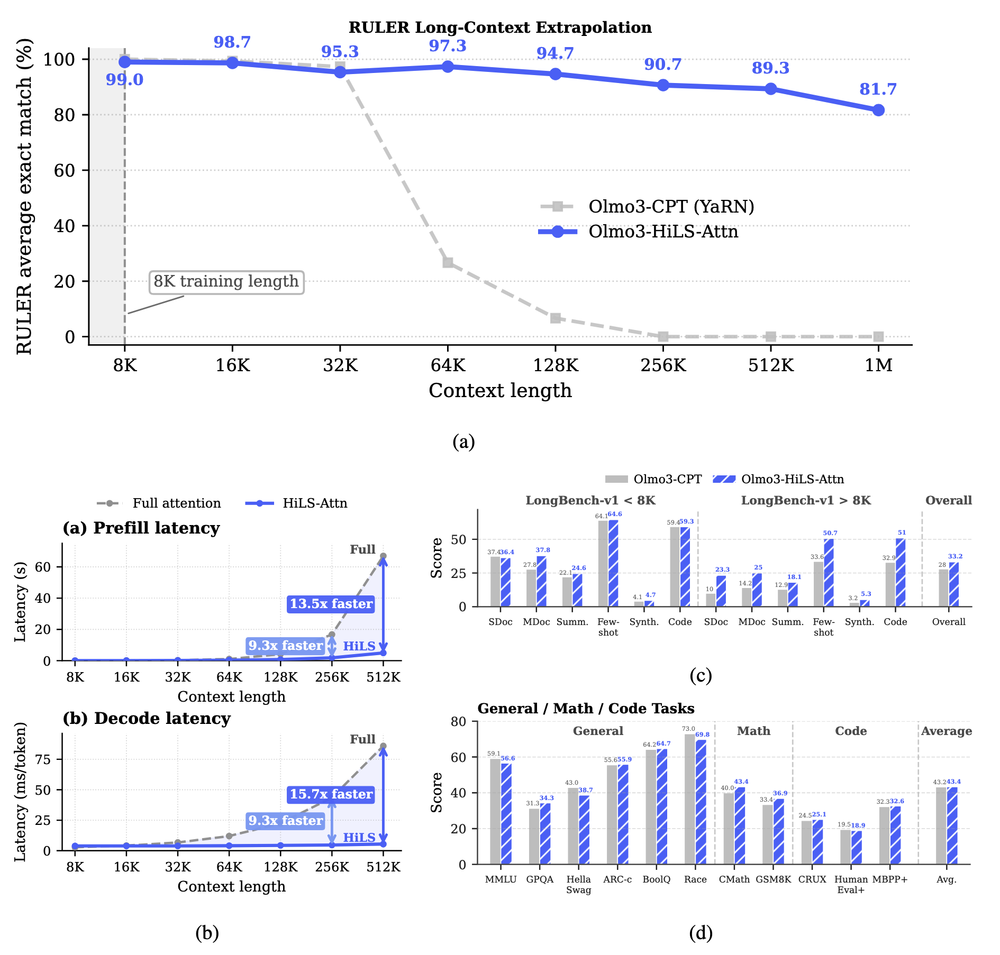

# HiLS-Attention: Hierarchical Sparse Attention Done Right

Official code for the paper [Hierarchical Sparse Attention Done Right: Toward Infinite Context Modeling](https://arxiv.org/abs/2607.02980).

<p align="center">
  <a href="https://arxiv.org/abs/2607.02980"></a>
  <a href="https://github.com/Tencent-Hunyuan/HiLS-Attention"></a>
  <a href="https://huggingface.co/tencent/HiLS-Attention-7B/tree/main"></a>
</p>

HiLS-Attention is a chunk-wise sparse attention mechanism that learns chunk selection end-to-end under the language-modeling loss, enabling native sparse training for efficient long-context modeling.


*Figure: Overview of HiLS-Attention. Naive block sparse attention selects top-k chunks by their exact chunk mass, but computing all chunk masses requires full QK computation. HiLS-Attention instead uses compressed chunk keys to estimate a chunk-mass surrogate and factorizes attention into inter-chunk and intra-chunk softmax, enabling end-to-end learning from the next-token prediction loss.*

## Performance



*Figure: After only 50B continued-training tokens, HiLS-Attention inherits the capability of full attention while bringing two key advantages: **strong ultra-long context extrapolation** beyond the YaRN-extended 4× length (a) and **faster inference** (b). Meanwhile, it preserves comparable performance for short- and medium-context tasks, within both the original training length and the YaRN-extrapolated range (c & d).*

## TODO

We are actively working on releasing more resources. Stay tuned!

- [x] Release training and evaluation code
- [x] Release pre-trained model checkpoints
- [x] Release SGLang inference code for efficient long-context serving

## Environment Setup

### Install via uv (recommended)

```bash
git clone https://github.com/Tencent-Hunyuan/HiLS-Attention.git
cd HiLS-Attention

# install uv
curl -LsSf https://astral.sh/uv/install.sh | sh

uv sync
source .venv/bin/activate
```

### Install via pip

```bash
git clone https://github.com/Tencent-Hunyuan/HiLS-Attention.git
cd HiLS-Attention

conda create -n hils python=3.11 -y
conda activate hils

pip install torch==2.8.0 torchvision==0.23.0 torchaudio==2.8.0 --index-url https://download.pytorch.org/whl/cu128
pip install -r requirements.txt
```


## Training


### Training from Scratch

```bash
export CORPUS_PATH=/path/to/tokenized/data
export OUTPUT_DIR=outputs/checkpoints/hils_attn_8KA2K_HoPE_345M_prop3p1_qcal_r64
bash scripts/pretrain/345M_exp_dist/pretrain_hils_attn_8KA2K_HoPE_345M_prop3p1_qcal_r64.sh
```


### Continue Pre-Training

```bash
export MODEL_PATH=/path/to/base/hf_ckpt
export CORPUS_PATH=/path/to/tokenized/data
export OUTPUT_DIR=outputs/checkpoints/olmo3_8KA2K_HoPE_qcal
bash scripts/cpt/cpt_olmo3_8KA2K_HoPE_qcal.sh
```

For landmark-token tuning, use `MODEL_PATH` to point to the base checkpoint directory:

```bash
export MODEL_PATH=/path/to/base/checkpoint
export CORPUS_PATH=/path/to/tokenized/data
export OUTPUT_DIR=outputs/checkpoints/olmo3_8KA2K_lmk_token_tuning
bash scripts/cpt/cpt_olmo3_8KA2K_lmk_token_tuning.sh
```


## Evaluation


### Checkpoint Format

Training saves distributed checkpoints (DCP). The PPL and RULER examples below load DCP checkpoints directly. HF conversion is only needed for HuggingFace-based generation or evaluation.

Convert DCP to HF format when needed:

```bash
DCP_PATH=/path/to/checkpoints/global_step_xxx \
bash scripts/ckpt_transfer/dcp_hf_transfer.sh
```

The converted checkpoint is saved under:

```text
/path/to/checkpoints/global_step_xxx/hf_ckpt
```


### Perplexity Evaluation

```bash
python eval/eval_ppl.py \
  --config_path configs/hils_attention/config_hils_attn_8KA2K_HoPE_345M_prop3p1_qcal_r64.json \
  --checkpoint_path /path/to/checkpoints/global_step_30000 \
  --use_dcp_checkpoint \
  --data_path /path/to/tokenized/eval/data \
  --max_seq_len 8192 \
  --last_k_tokens 512  # compute PPL on the last 512 tokens only
```


### RULER Evaluation

```bash
python eval/eval_ruler.py \
  --config_path configs/hils_attention/config_hils_attn_8KA2K_HoPE_345M_prop3p1_qcal_r64.json \
  --checkpoint_path /path/to/checkpoints/global_step_30000 \
  --corpus_path /path/to/tokenized/eval/data \
  --max_seq_len 8192 \
  --task_id 0  # 0: S-N, 1: MK-MQ, 2: VT
```


### OLMo3 7B Evaluations

OLMo3-7B evaluations use **HF checkpoints** (`global_step_xxx/hf_ckpt`) and the Olmo3 tokenizer under `configs/olmo3_vocab/`. Convert DCP checkpoints first (see [Checkpoint Format](#checkpoint-format) above).

Each batch script lives under `scripts/eval/`. Edit the `MODELS` / `MODEL_NAMES` block at the top of the script to point to your checkpoint and HiLS config (`configs/olmo3_7B/*.json`). Logs are written to `scripts/eval/logs/`.

#### 1. LongBench v1 (long-context QA)

```bash
bash scripts/eval/eval_olmo3_longbench_v1.sh
```


| Setting      | Default           | Notes                                                               |
| ------------ | ----------------- | ------------------------------------------------------------------- |
| `MAX_LENGTH` | `65536`           | Max input length (middle truncation)                                |
| `DATASETS`   | all 21 tasks      | Set comma-separated names to run a subset, e.g. `"hotpotqa,qasper"` |
| `GPU_IDS`    | `0 1 2 3 4 5 6 7` | One GPU per model; jobs are queued automatically                    |


Per-task predictions and scores are saved under `scripts/eval/logs/eval_longbench_v1_<timestamp>/<model_name>/`.

#### 2. OpenCompass (short-context benchmarks)

11 benchmarks covering knowledge, reasoning, and code. Uses the Transformers backend with a multi-GPU job queue (one dataset per GPU by default).

**One-time setup** — clone [OpenCompass](https://github.com/open-compass/opencompass) and install:

```bash
git clone https://github.com/open-compass/opencompass.git scripts/eval/opencompass
bash scripts/eval/install_opencompass.sh
export OPENCOMPASS_PATH=scripts/eval/opencompass
export PYTHONPATH=$PWD:$OPENCOMPASS_PATH:$PYTHONPATH
```

**Run:**

```bash
bash scripts/eval/eval_olmo3_opencompass.sh
```


| Benchmark                                 | Type                  |
| ----------------------------------------- | --------------------- |
| MMLU, GPQA, HellaSwag, ARC-c, BoolQ, RACE | Few-shot PPL          |
| GSM8K, CMath                              | Math generation (CoT) |
| HumanEval+, MBPP+, CRUXEval-O             | Code generation       |


Results land in `scripts/eval/logs/eval_olmo3_opencompass_<timestamp>/`. A LaTeX summary table is written to `summary.log`. HumanEval+ / MBPP+ are re-scored with `evalplus` after inference.

For MBPP+, place the evalplus-format jsonl at `data/mbpp_plus/mbpp_plus.jsonl` (see `eval/configs/datasets/mbpp_plus_gen.py`).

#### 3. PPL + RULER (long-context probing)

Batch PPL and RULER over multiple sequence lengths. PPL uses Dolma3 tokenized data; RULER runs tasks 0 (S-N), 1 (MQ-N), and 2 (VT).

```bash
# both PPL and RULER (default)
bash scripts/eval/eval_olmo3_ruler_ppl.sh

# PPL only or RULER only
EVAL_MODE=ppl  bash scripts/eval/eval_olmo3_ruler_ppl.sh
EVAL_MODE=ruler bash scripts/eval/eval_olmo3_ruler_ppl.sh
```


| Setting                                 | Default                                           | Notes                                        |
| --------------------------------------- | ------------------------------------------------- | -------------------------------------------- |
| PPL lengths                             | 64 … 256K                                         | Skips lengths ≤ `chunk_size` for HiLS models |
| RULER lengths                           | 8K, 16K, 32K, 128K                                |                                              |
| `PPL_DATA_PATH`                         | `../../data/dolma3_mix-6T-1025-partial-tokenized` | Tokenized eval corpus                        |
| `PPL_LAST_K_TOKENS`                     | `512`                                             | PPL computed on last 512 tokens only         |
| `PPL_MAX_SAMPLES` / `RULER_MAX_SAMPLES` | `100` / `50`                                      |                                              |


Logs and a LaTeX summary (`summary.log`) are saved to `scripts/eval/logs/eval_olmo3_<mode>_<timestamp>/`.

## Efficient Inference with SGLang

HiLS-Attention has a native [SGLang](https://github.com/sgl-project/sglang) serving
backend that implements the hierarchical sparse attention as a first-class attention
backend, so the released checkpoints (e.g. [HiLS-Attention-7B](https://huggingface.co/tencent/HiLS-Attention-7B))
can be served with the standard SGLang server and OpenAI-compatible API, and enjoy
HiLS-Attention's long-context speedups over dense attention (increasing with sequence
length). The backend is numerically aligned with the reference model.

The backend lives in a fork: **[FoundationResearch/sglang @ `hsa-release`](https://github.com/FoundationResearch/sglang/tree/hsa-release)**.
See its [HSA README](https://github.com/FoundationResearch/sglang/blob/hsa-release/python/sglang/srt/layers/attention/hsa/README.md)
for full environment, config, and benchmark details.

### Quick start

```bash
# 1. Install the SGLang fork with the HSA backend
git clone -b hsa-release https://github.com/FoundationResearch/sglang.git
cd sglang && pip install -e "python[all]"
# HSA selection kernels also require `tilelang` (see the fork's HSA README).

# 2. Download the released checkpoint
huggingface-cli download tencent/HiLS-Attention-7B --local-dir ./HiLS-Attention-7B

# 3. Convert the checkpoint for SGLang (translates config.json; weights are symlinked)
python scripts/convert_hils_checkpoint.py \
    --src ./HiLS-Attention-7B --dst ./HiLS-Attention-7B-sglang

# 4a. Serve (OpenAI-compatible API on http://localhost:30000)
python -m sglang.launch_server --model-path ./HiLS-Attention-7B-sglang \
    --attention-backend hsa --page-size 64 --trust-remote-code

# 4b. Or run offline on your own prompts
python scripts/run_hsa_infer.py --model-path ./HiLS-Attention-7B-sglang \
    "The capital of France is" "Water is made of hydrogen and"
```

> `--page-size` **must** equal the model's `chunk_size` (64). The backend
> auto-configures the required HSA serving constraints (single-sequence prefill;
> overlap scheduler disabled) — no extra flags needed.

## Citation

```bibtex
@misc{hu2026hierarchicalsparseattentionright,
      title={Hierarchical Sparse Attention Done Right: Toward Infinite Context Modeling}, 
      author={Xiang Hu and Xinyu Wei and Hao Gu and Minshen Zhang and Tian Liang and Huayang Li and Lei Zhu and Yan Wang and Sirui Han and Yushi Bai and Kewei Tu and Haitao Mi and Leo Liang},
      year={2026},
      eprint={2607.02980},
      archivePrefix={arXiv},
      primaryClass={cs.CL},
      url={https://arxiv.org/abs/2607.02980}, 
}
```

