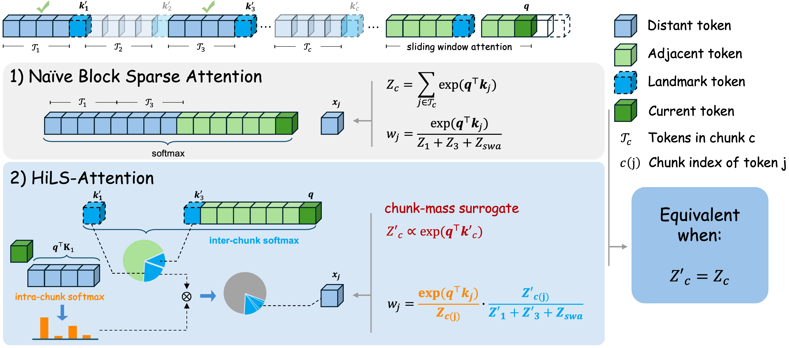

# HiLS-Attention: Hierarchical Sparse Attention Done Right

Official code for the paper [Hierarchical Sparse Attention Done Right: Toward Infinite Context Modeling](https://arxiv.org/abs/2607.02980).


[](https://arxiv.org/abs/2607.02980)
[](https://github.com/Tencent-Hunyuan/HiLS-Attention)

HiLS-Attention is a chunk-wise sparse attention mechanism that learns chunk selection end-to-end under the language-modeling loss, enabling native sparse training for efficient long-context modeling.



*Figure: Overview of HiLS-Attention. Naive block sparse attention selects top-k chunks by their exact chunk mass, but computing all chunk masses requires full QK computation. HiLS-Attention instead uses compressed chunk keys to estimate a chunk-mass surrogate and factorizes attention into inter-chunk and intra-chunk softmax, enabling end-to-end learning from the next-token prediction loss.*


## Environment Setup

```bash
git clone https://github.com/Tencent-Hunyuan/HiLS-Attention.git
cd HiLS-Attention

conda create -n hils python=3.11 -y
conda activate hils

pip install torch==2.8.0 torchvision==0.23.0 torchaudio==2.8.0 --index-url https://download.pytorch.org/whl/cu128

pip install -r requirements.txt

```


## Training
### Training from Scratch


```bash
export CORPUS_PATH=/path/to/tokenized/data
export OUTPUT_DIR=outputs/checkpoints/hils_attn_8KA2K_HoPE_345M_prop3p1_qcal_r64
bash scripts/pretrain/345M_exp_dist/pretrain_hils_attn_8KA2K_HoPE_345M_prop3p1_qcal_r64.sh
```

### Continue Pre-Training


```bash
export MODEL_PATH=/path/to/base/hf_ckpt
export CORPUS_PATH=/path/to/tokenized/data
export OUTPUT_DIR=outputs/checkpoints/olmo3_8KA2K_HoPE_LoRA
bash scripts/cpt/cpt_olmo3_8KA2K_HoPE_LoRA.sh
```

For landmark-token tuning, use `MODEL_PATH` to point to the base checkpoint directory:

```bash
export MODEL_PATH=/path/to/base/checkpoint
export CORPUS_PATH=/path/to/tokenized/data
export OUTPUT_DIR=outputs/checkpoints/olmo3_8KA2K_lmk_token_tuning
bash scripts/cpt/cpt_olmo3_8KA2K_lmk_token_tuning.sh
```


## Evaluation

### Checkpoint Format

Training saves distributed checkpoints (DCP). Some evaluation scripts can load DCP directly; generation and HuggingFace-based evaluation require HF-format checkpoints.

Convert DCP to HF format:

```bash
DCP_PATH=/path/to/checkpoints/global_step_xxx \
bash scripts/ckpt_transfer/dcp_hf_transfer.sh
```

The converted checkpoint is saved under:

```text
/path/to/checkpoints/global_step_xxx/hf_ckpt
```

### Perplexity Evaluation


```bash
python eval/eval_ppl.py \
  --config_path configs/hils_attention/config_hils_attn_8KA2K_HoPE_345M_prop3p1_qcal_r64.json \
  --checkpoint_path /path/to/checkpoints/global_step_30000 \
  --use_dcp_checkpoint \
  --data_path /path/to/tokenized/eval/data \
  --max_seq_len 8192 \
  --last_k_tokens 512  # compute PPL on the last 512 tokens only
```

### RULER Evaluation

```bash
python eval/eval_ruler.py \
  --config_path configs/hils_attention/config_hils_attn_8KA2K_HoPE_345M_prop3p1_qcal_r64.json \
  --checkpoint_path /path/to/checkpoints/global_step_30000 \
  --corpus_path /path/to/tokenized/eval/data \
  --max_seq_len 8192 \
  --task_id 0  # 0: S-N, 1: MK-MQ, 2: VT
```

### OLMo3 7B Evaluations


```bash
bash scripts/eval/eval_olmo3_ruler_ppl.sh
bash scripts/eval/eval_olmo3_longbench_v1.sh
bash scripts/eval/eval_olmo3_opencompass.sh
```


## Citation

```bibtex
@misc{hu2026hierarchicalsparseattentionright,
      title={Hierarchical Sparse Attention Done Right: Toward Infinite Context Modeling}, 
      author={Xiang Hu and Xinyu Wei and Hao Gu and Minshen Zhang and Tian Liang and Huayang Li and Lei Zhu and Yan Wang and Sirui Han and Yushi Bai and Kewei Tu and Haitao Mi and Leo Liang},
      year={2026},
      eprint={2607.02980},
      archivePrefix={arXiv},
      primaryClass={cs.CL},
      url={https://arxiv.org/abs/2607.02980}, 
}
```
